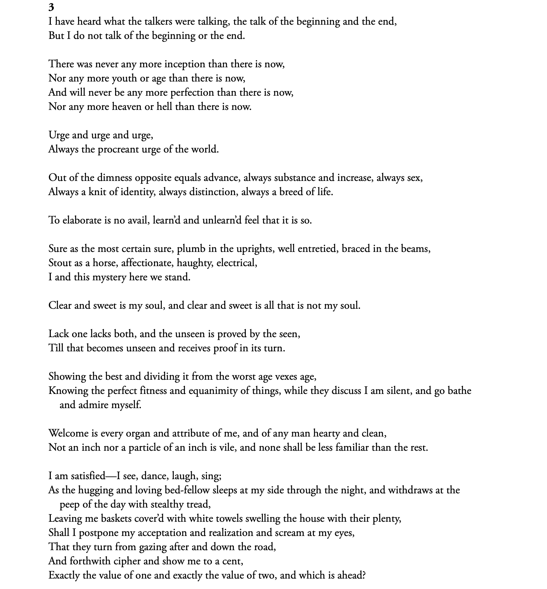

# simple-OCR

This project provides a simple OCR (Optical Character Recognition) tool to extract text from images and PDF files using Python. It utilizes libraries such as OpenCV, Tesseract, and PDF2Image to process and extract text from different file formats.

## what can it do?

- Perform OCR on JPEG/JPG, PNG, and PDF files.
- Save the extracted text to a file.
- Support for multiple pages in PDF files.
- **Supported File Types:**
      - **Images**: JPEG, JPG, PNG
      - **Documents**: PDF

## Installation

1. **Clone the repository**:
   ```sh
   git clone https://github.com/jayanthchennamaneni/simple-OCR.git
   cd simple-OCR
   ```

2. **Create a virtual environment** (optional but recommended):
   ```sh
   python -m venv venv
   source env/bin/activate  # On Windows use `venv\Scripts\activate`
   ```

3. **Install the required packages**:
   ```sh
   pip install -r requirements.txt
   ```
4. **script usage**:
   ```sh
   python ocr.py whitman.png
   ```

## Examples

1. **Image (whitman excerpt)**:
```

```

**Extracted Text**:
can also read the image [here](Extracted_texts/extracted_png.txt)

```txt

3
I have heard what the talkers were talking, the talk of the beginning and the end,
But I do not talk of the beginning or the end.

There was never any more inception than there is now,
Nor any more youth or age than there is now,

And will never be any more perfection than there is now,
Nor any more heaven or hell than there is now.

Urge and urge and urge,
Always the procreant urge of the world.

Out of the dimness opposite equals advance, always substance and increase, always sex,
Always a knit of identity, always distinction, always a breed of life.

To elaborate is no avail, learn’d and unlearn’d feel that it is so.

Sure as the most certain sure, plumb in the uprights, well entretied, braced in the beams,
Stout as a horse, affectionate, haughty, electrical,
land this mystery here we stand.

Clear and sweet is my soul, and clear and sweet is all that is not my soul.

Lack one lacks both, and the unseen is proved by the seen,
Till that becomes unseen and receives proof in its turn.

Showing the best and dividing it from the worst age vexes age,
Knowing the perfect fitness and equanimity of things, while they discuss I am silent, and go bathe
and admire myself.

Welcome is every organ and attribute of me, and of any man hearty and clean,
Not an inch nor a particle of an inch is vile, and none shall be less familiar than the rest.

Iam satisfied—I see, dance, laugh, sing;

As the hugging and loving bed-fellow sleeps at my side through the night, and withdraws at the
peep of the day with stealthy tread,

Leaving me baskets cover'd with white towels swelling the house with their plenty,

Shall I postpone my acceptation and realization and scream at my eyes,

That they turn from gazing after and down the road,

And forthwith cipher and show me to a cent,

Exactly the value of one and exactly the value of two, and which is ahead?

```

2. **PDF file**:
Full document can be accessed [here](dinner41.pdf).

**Extracted Text**:

Full document can be accessed [here](Extracted_texts/extracted_pdf.txt).


## Additional Resources

- [Tesseract OCR Documentation](https://tesseract-ocr.github.io/)
- [OpenCV Documentation](https://docs.opencv.org/)
